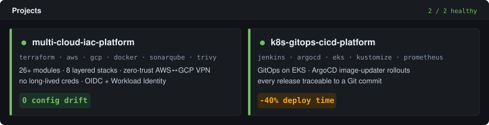
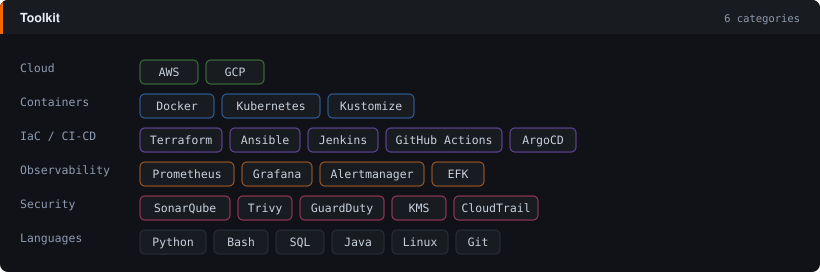
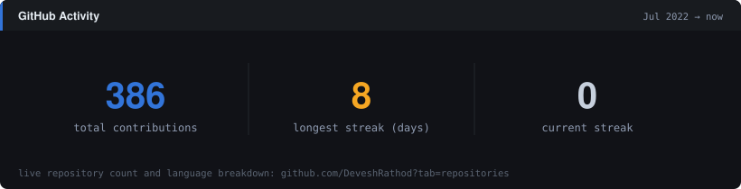
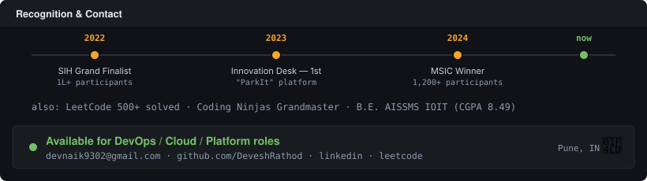

<!--
  ┌─────────────────────────────────────────────────────────────┐
  │  Devesh Rathod — GitHub profile README                       │
  │  Setup: put this file at DeveshRathod/DeveshRathod/README.md  │
  │  and commit graf-01…04.svg to the repo root alongside it.    │
  └─────────────────────────────────────────────────────────────┘
-->

<!-- Overview: name, role, animated gauge dials -->

<!-- Projects: status cards -->

<!-- Toolkit -->

<!-- GitHub activity: self-contained, no external service dependency -->

<!-- Recognition timeline + contact -->

